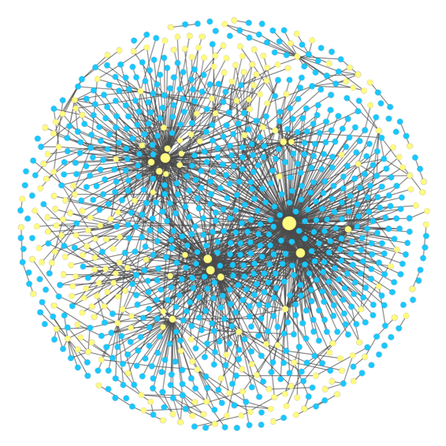

# Resistance and robustness of the global coral-symbiont network
## Williams and Patterson, Ecology 2020

 

## Citation:

## Link to article:

### Data S1
Data S1 contains files needed to make the networks in the Resistance and Robustness code (Data S2). 

### Data S2
All code for the network bleaching model, null network models, and robustness removal models was written in Python 2.7.16 using jupyter notebook and R version 3.5.1 using R studio. 

#### CODE

For simulating the bleaching model (Eq. 1), calculating resistance, degree distribution fitting, the host-specific network, and the generalized network:
	BleachingModel_Resistance_Py27.ipynb – Jupyter notebook

For the removal models and robustness analyses:
	RemovalModels_Robustness_Py27.ipynb – Jupyter notebook

For visualizing the model results, statistics described in Appendix S2, and code for symbiont node tolerances:
	StatisticsAndVisualization_R35.rmd – Rmarkdown

